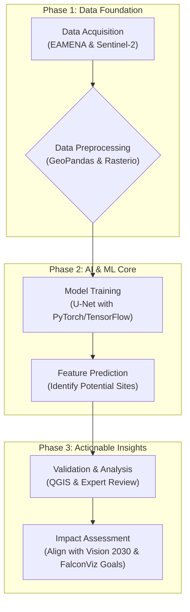

# GEO-AI Vision for Saudi Arabia: Unlocking Heritage with AI

## The Vision: Beyond Photogrammetry

Saudi Arabia's Vision 2030 places immense value on the Kingdom's rich cultural heritage. While traditional methods like photogrammetry have been foundational, the next leap forward lies in leveraging Artificial Intelligence to analyze vast amounts of satellite data at scale.

This project proposes a framework for an **AI-driven pipeline to automatically identify potential archaeological features** across the Kingdom, turning terabytes of imagery into actionable heritage insights. It's a vision that moves from mapping known sites to discovering unknown ones.

---

## Project Proposal: Automated Archaeological Feature Detection

### Executive Summary

This document outlines a proof-of-concept project to develop a deep learning model capable of performing semantic segmentation on Sentinel-2 satellite imagery. The model's objective is to highlight land features and subsurface soil marks that are indicative of ancient human settlements, agricultural systems, or other archaeological points of interest. This proactive approach to discovery can significantly augment the efforts of archaeologists and heritage preservation bodies.

### Project Workflow

The proposed workflow integrates modern data science tools into a cohesive pipeline, from data acquisition to impact assessment.

### Methodology & Technical Stack

The project is designed around the specific technologies and skills requested by leaders in the field, ensuring its relevance and feasibility.

*   **Data Sources:**
    *   **Ground Truth:** Vector data (GeoJSON/Shapefiles) from the **EAMENA database** will be used to create training masks for known archaeological sites.
    *   **Satellite Imagery:** **Sentinel-2 multispectral imagery** will be programmatically downloaded via the `sentinelsat` API for the corresponding areas of interest.

*   **Core Technology:**
    *   **Geospatial Processing:** `GeoPandas` and `rasterio` will be used for all geospatial data manipulation, including clipping, re-projecting, and aligning the imagery with the vector masks.
    *   **Deep Learning Model:** A **U-Net architecture**, implemented in `PyTorch` or `TensorFlow`, will be trained to perform the pixel-level classification (semantic segmentation). The U-Net is exceptionally well-suited for identifying features in satellite imagery.
    *   **Analysis & Validation:** `QGIS` will be used to visualize and validate the model's predictions against known data and high-resolution imagery.

### Strategic Alignment & Impact

This project is not just a technical exercise; it's a strategic initiative with direct benefits:

1.  **For FalconViz:** It provides a scalable, innovative service offering in the Cultural Heritage sector, moving beyond data capture to data intelligence. It directly aligns with the company's established expertise in drone mapping and reality capture by adding a powerful "discovery" phase to their workflow.
2.  **For Saudi Vision 2030:** It actively contributes to the national goal of preserving and celebrating the Kingdom's heritage. An AI-powered discovery engine can help prioritize areas for protection, tourism development (e.g., NEOM, Al-'Ula), and further scholarly research.

This proposal represents a fusion of cutting-edge AI with a deep respect for the past, tailored specifically for the opportunities within Saudi Arabia. 